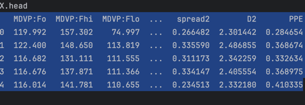
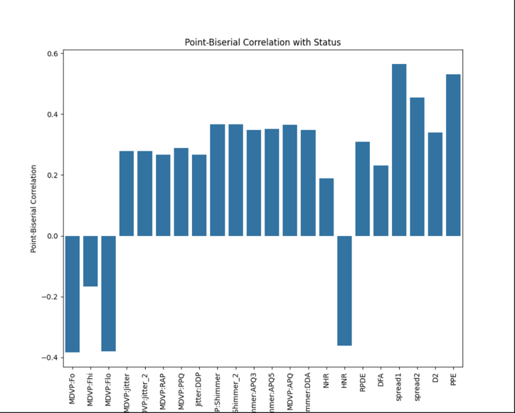

# Data exploration

## Dataset

***"Oxford Parkinson's Disease Detection Dataset"***  
*"Little MA, McSharry PE, Hunter EJ, Ramig LO. Suitability of dysphonia measurements for telemonitoring of Parkinson's disease [dataset]. UC Irvine Machine Learning Repository. 2008."*

Repository: https://archive.ics.uci.edu/dataset/174/parkinsons  
Publication: https://www.ncbi.nlm.nih.gov/pmc/articles/PMC3051371/

 

This dataset contains vocal measurements of individuals with and without Parkinson's disease. This resource is valuable for studying the potential of acoustics in aiding the diagnosis of Parkinson's disease.

## Dysphonia
Dysphonia is a medical term that refers to difficulty or impairment in voice production, often resulting in changes in voice quality, pitch, loudness, or resonance.  

In individuals with Parkinson's disease, their vocal measurements may indicate dysphonia-related voice irregularities. Inn healthy individuals, the same measurements may contain data reflecting normal voice characteristics without dysphonia.

## Publication summary

The publication presents an evaluation of traditional and novel measures to distinguish healthy individuals from those with Parkinson's disease (PD) by detecting dysphonia. A new measure called Pitch Period Entropy (PPE) is introduced, designed to be robust to confounding effects like noisy environments.

They achieved 91.4% correct classification using a kernel support vector machine. The study concludes that non-standard methods are most effective in distinguishing between healthy and PD subjects. 
It explores various speech measurement methods and their applications in assessing dysphonia, focusing on sustained phonation tests. The data, consisting of sustained vowel phonations from male and female subjects with varying PD stages and years since diagnosis, were recorded using a microphone and processed for analysis.

The publication and dataset published contribute to understanding of dysphonia in PD and provide insights into developing reliable telemedicine tools for remote patient monitoring.

## Fetching 
***script: data_exploration.py*** 

147 rows (voice recordings) taken from 23 patients with Parkinson's disease.   
48 rows (voice recordings) taken from 8 individuals without Parkinson's disease.

Values found range from -10.0 to 200.0
There are no missing values. 
There are duplicated columns names.

## Processing 
***script: logic.data_processing.py*** 

First step is to rename the duplicates by adding "_2" to the column name.

The values of each measure are pre-processed by scaling them to occupy the numerical range [-1, 1]

How to augment this dataset?

## Correlation
***script: correlation.py***

## Decisions

Once the data was understood and explored the following decisions were made:

### Type of Machine Learning

Supervised learning is the chosen approach because the targets are clearly labeled as 0 (no Parkinson) or 1 (Parkinson's positive). The data is labeled, making it suitable for supervised learning techniques.

