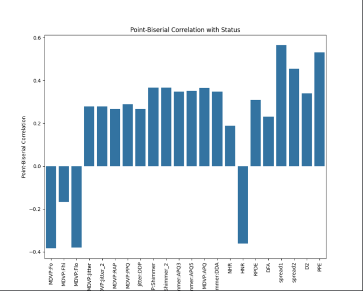

# Data exploration

## Fetching data 
***script: data_exploration.py*** 

There are no missing values. However, there are duplicated columns names.
First step is to rename the duplicates by adding "_2" to the column name.

## Correlation
***script: correlation.py***

## Decisions

Once the data was understood and explored the following decisions were made:

### Type of Machine Learning

Supervised learning is the chosen approach because the targets are clearly labeled as 0 (no Parkinson) or 1 (Parkinson's positive). The data is labeled, making it suitable for supervised learning techniques.

### Models for comparison

The following model were chosen for performance comparison:

- logistic regression
- random forest
- deep neural network

### Project pattern

In case this project would be further developed in the future, there will be a separation of concerns applied. **MVC** design pattern will be used for clarity, maintainability and scalability.  

!!! Term *model* is used here in two different contexts. 'model' as machine learning algorithm and 'Model' as an element of MVC pattern.
To prevent confusion the MVC's Model will be called further ***Logic***.

#### Logic
The Model handles the core logic of the application. This includes
- data processing
- feature extraction
- model training/prediction
- model's comparison

#### View
The View is responsible for 

- plots
- presenting data
- generating reports 

#### Controller
The Controller manages

- managing workflow
- handling user inputs and actions
- coordinating between Logic and View