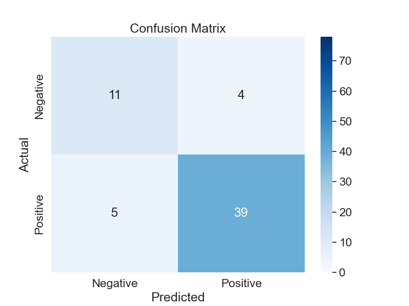
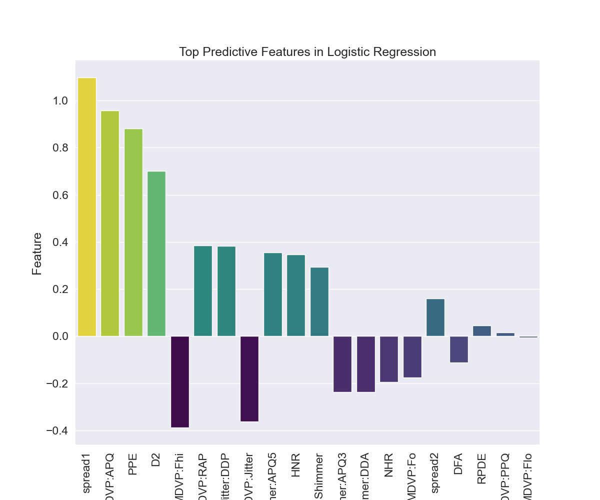
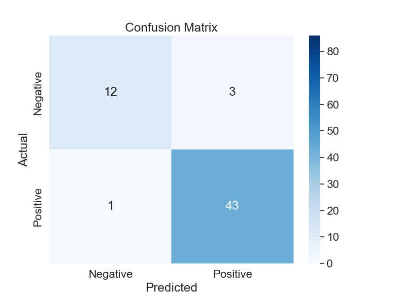
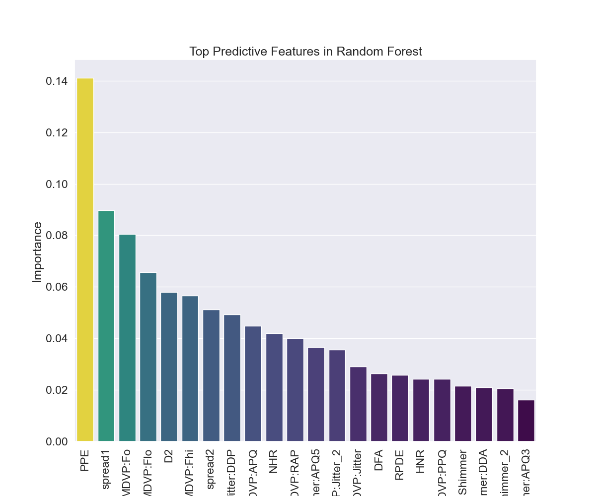

# Final evaluation report

## Research question 

***"Which vocal features together with which machine learning model are most predictive of Parkinson's disease?"***

In the mentioned publication (see ***data.md***) they measured SVM model. It turned out that measure called Pitch Period Entropy (PPE) alone achieved an accuracy of 85.6%. This means it's the best single feature to be used with SVM. 

The following models will be further measured as part of MMI Module 12 project:

- logistic regression
- random forest
- deep neural network

For each of these models the best performing feature will be found.

## Introduction

### Motivation and Background
This dataset was chosen because of author's interest in the potential of human generated acoustics to detect diseases, with the biggest interest in obstructive sleep apnea (OSA). OSA is when patient stops breathing during sleep. It is a mechanical event. The thought process is that if certain anatomical features cause OSA event they may also influence the way person speaks and breaths during daytime and create dysphonia. Therefore there is another question: may certain dysphonias serve as a predictive factor for OSA?

### Preparatory activities

First of all I fetched the dataset and explored in order to understand the topic better (see ***data.md***). Then I created the outline of a project solution in Python. I used a simple MVC pattern (see ***code.md***).

## Logistic regression

***Script:*** logic.regression.py

### Performance
Accuracy: 0.85  
Sensitivity: 0.89  
Specificity: 0.73

In summary, while the logistic regression model demonstrates strong overall performance, there are areas for improvement, particularly in reducing false positives and false negatives.

### Most predictive features

Positive coefficients indicate a positive relationship, meaning an increase in the feature value is associated with an increase in the likelihood of having Parkinson's disease, while negative coefficients indicate a negative relationship.

### Comparison to SVM study

Features like spread1, MDVP , PPE, and D2 show significant positive coefficients in logistic regression, indicating their importance in predicting Parkinson's disease, which aligns with the SVM study's findings.

However, the exact numerical values and ranking of features is different. Due to differences in model assumptions and optimization techniques.

spread1 is the most predictive for logistic regression. However PPE is on the third place.

## Random forest

### Performance
Accuracy: 0.93  
Sensitivity: 0.98  
Specificity: 0.8      

## Deep neural network

### Performance