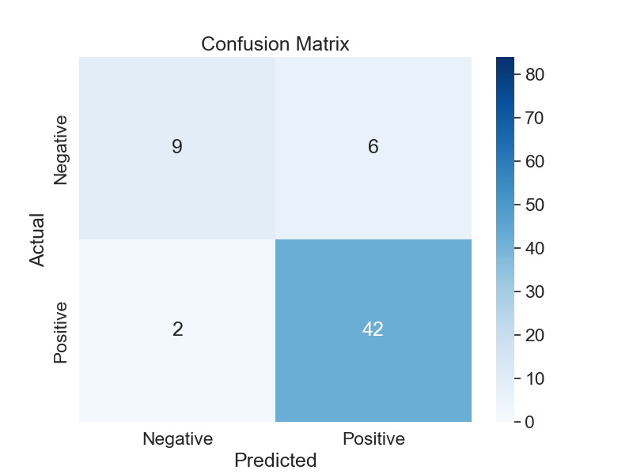

# Final evaluation report

## Research question 

***"Which vocal features together with which machine learning model are most predictive of Parkinson's disease?"***

In the mentioned publication (see ***data.md***) they measured SVM model. It turned out that measure called Pitch Period Entropy (PPE) alone achieved an accuracy of 85.6%. This means it's the best single feature to be used with SVM. 

The following models will be further measured as part of MMI Module 12 project:

- logistic regression
- random forest
- deep neural network

For each of these models the best performing feature will be found.

## Introduction

### Motivation and Background
This dataset was chosen because of author's interest in the potential of human generated acoustics to detect diseases, with the biggest interest in obstructive sleep apnea (OSA). OSA is when patient stops breathing during sleep. It is a mechanical event. The thought process is that if certain anatomical features cause OSA event they may also influence the way person speaks and breaths during daytime and create dysphonia. Therefore there is another question: may certain dysphonias serve as a predictive factor for OSA?

### Preparatory activities

First of all I fetched the dataset and explored in order to understand the topic better (see ***data.md***). Then I created the outline of a project solution in Python. I used a simple MVC pattern (see ***code.md***).

## Models comparison

### Performance
Putting everything into a table:

|             | Logistic Regression | Random Forest | DNN    | SVM (from publication) |
|-------------|---------------------|---------------|--------|------------------------|
| Accuracy    | 0.86                | 0.93          | 0.90   | 0.906                  |
| Sensitivity | 0.95                | 0.98          | 0.95   | 0.907                  |
| Specificity | 0.6                 | 0.8           | 0.73   | 0.904                  |

| Metric      | Logistic Regression | Random Forest | DNN    |
|-------------|---------------------|---------------|--------|
| Precision   | 0.82 / 0.88         | 0.92 / 0.93   | 0.85 / 0.91   |
| Recall      | 0.60 / 0.95         | 0.80 / 0.98   | 0.73 / 0.95   |
| F1-score    | 0.69 / 0.91         | 0.86 / 0.96   | 0.79 / 0.93   |

### Metrics interpretation:

Random forest achieved the highest accuracy, sensitivity, the highest precision for both classes, the highest recall for both classes, the highest F1-score for both classes indicating its ability to correctly classify instances. 

### Best predictive features

I was able to create features comparison for logistic regression and random forest:  

It turned out however to be a very difficult task to generate such plot for deep neural network. There were problems with tensorflow versioning and even using ChatGPT I couldn't find a solution after over 1 hour of fightingin with this issue.

***Interpretation***

Features like spread1, MDVP , PPE, and D2 show significant positive coefficients in logistic regression, indicating their importance in predicting Parkinson's disease, which aligns with the SVM study's findings.

However, the exact numerical values and ranking of features is different. Due to differences in model assumptions and optimization techniques.

Positive coefficients indicate a positive relationship, meaning an increase in the feature value is associated with an increase in the likelihood of having Parkinson's disease, while negative coefficients indicate a negative relationship.

Random forest confirmed that most predictive feature is PPE, same result as fpor SVM model from publication. However logistic regression pointed at spread1 feature. 
*(spread1 and PPE - are both nonlinear measures of fundamental frequency variation.)*

### Conclusion:

Random forest performed the best, making it the top-performing model overall.
It seems however there is huge potential in deep neural network with its huge opportunity to tune this model further and ouperform the other models.

Overall, the choice of the best model depends on the specific requirements of the task and the importance assigned to different evaluation metrics such as accuracy, sensitivity, and specificity.

# Models' output

## Logistic regression

***Script:*** logic.regression.py

### Performance

## Random forest
***Script:*** logic.random_forest.py

### Performance

## Deep neural network
***Script:*** logic.deep_neural_network.py
### Performance

